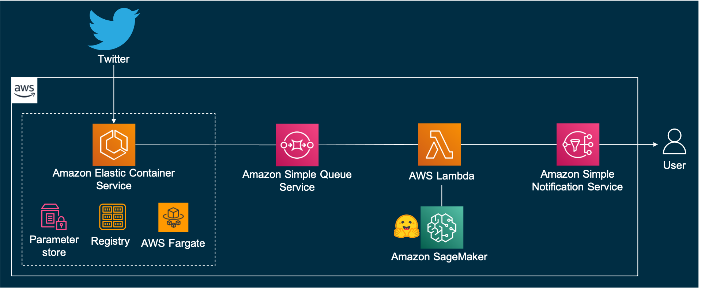

# Tweet classification for real-time alerts with Amazon SageMaker and Hugging Face

This package includes a sample of a real-time alert system that consumes news from Twitter and classifies the tweets
using a pre-trained zero-shot model available in Hugging Face Hub and deployed with Amazon SageMaker.

The sample application includes some backend resources (`bakend` directory) and a container that gets tweets from a
Twitter stream (`stream-getter` directory).

## Deploy instructions

Deploying the sample application builds the following environment in the AWS Cloud:



## Prerequisites

* AWS CLI. Refer to [Installing the AWS CLI](https://docs.aws.amazon.com/cli/latest/userguide/cli-chap-install.html)
* AWS Credentials configured in your environment. Refer to
  [Configuration and credential file settings](https://docs.aws.amazon.com/cli/latest/userguide/cli-configure-files.html)
* AWS SAM CLI. Refer
  to [Installing the AWS SAM CLI](https://docs.aws.amazon.com/serverless-application-model/latest/developerguide/serverless-sam-cli-install.html)
* AWS Copilot CLI. Refer to
  [Install Copilot](https://aws.github.io/copilot-cli/docs/getting-started/install/)
* Twitter application Bearer token. Refer
  to [OAuth 2.0 Bearer Token - Prerequisites](https://developer.twitter.com/en/docs/authentication/oauth-2-0/bearer-tokens)
* Twitter Filtered stream rules configured. Refer to the examples in the end of this document and to
  [Building rules for filtered stream](https://developer.twitter.com/en/docs/twitter-api/tweets/filtered-stream/integrate/build-a-rule)
* Docker. Refer to [Docker](https://www.docker.com/products/docker-desktop)

## Backend resources

Run the command below, from within the `backend/` directory, to deploy the backend:

```
sam build --use-container && sam deploy --guided
```

Follow the prompts.

The command above deploys a AWS CloudFormation stack in your AWS account. You will need the stack's output values to deploy
the Twitter stream getter container.

## Twitter stream getter container

Run the command below, from within the `stream-getter/` directory, to deploy the container application:

### 1. Create application

```
copilot app init twitter-app
```

### 2. Create environment

```
copilot env init --name test --region <BACKEND_STACK_REGION>
```

Replace `<BACKEND_STACK_REGION>` with the same region to which you deployed the backend resources previously.

Follow the prompts accepting the default values.

The above command provisions the required network infrastructure (VPC, subnets, security groups, and more). In its
default configuration, Copilot
follows [AWS best practices](https://aws.amazon.com/blogs/containers/amazon-ecs-availability-best-practices/) and
creates a VPC with two public and two private subnets in different Availability Zones (AZs). For security reasons, we'll
soon configure the placement of the service as _private_. Because of that, the service will run on the private subnets
and Copilot will automatically add NAT Gateways, but NAT Gateways increase the overall cost. In case you decide to run
the application in a single AZ to have only one NAT Gateway **(not recommended)**, you can run the following command
instead:

```
copilot env init --name test --region <BACKEND_STACK_REGION> \
    --override-vpc-cidr 10.0.0.0/16 --override-public- cidrs 10.0.0.0/24 --override-private-cidrs 10.0.1.0/24
```

**Note:** The current implementation is prepared to run one container at a time solely. Not only your Twitter account
should allow you to have more than one Twitter's stream connection at a time, but the application also must be modified
to handle other complexities such as duplicates (learn more
in [Recovery and redundancy features](https://developer.twitter.com/en/docs/twitter-api/tweets/filtered-stream/integrate/recovery-and-redundancy-features)).
Even though there will be only one container running at a time, having two AZs is still recommended, because in case
one AZ is down, ECS can run the application in the other AZ.

### 3. Create service

```
copilot svc init --name stream-getter --svc-type "Backend Service" --dockerfile ./Dockerfile
```

### 4. Create secret to store the Twitter Bearer token

```
copilot secret init --name TwitterBearerToken
```

When prompted to provide the secret, paste the Twitter Bearer token.

### 5. Edit service manifest

Open the file `copilot/stream-getter/manifest.yml` and change its content to the following:

```
name: stream-getter
type: Backend Service

image:
  build: Dockerfile

cpu: 256
memory: 512
count: 1
exec: true

network:
  vpc:
    placement: private

variables:
  SQS_QUEUE_URL: <SQS_QUEUE_URL>
  LOG_LEVEL: info

secrets:
  BEARER_TOKEN: /copilot/${COPILOT_APPLICATION_NAME}/${COPILOT_ENVIRONMENT_NAME}/secrets/TwitterBearerToken
```

Replace `<SQS_QUEUE_URL>` with the URL of the SQS queue deployed in your AWS account.

You can use the following command to get the value from the backend AWS CloudFormation stack outputs
(replace `<BACKEND_STACK_NAME>` with the name of your backend stack):

```
aws cloudformation describe-stacks --stack-name <BACKEND_STACK_NAME> \
    --query "Stacks[].Outputs[?OutputKey=='TweetsQueueUrl'][] | [0].OutputValue"
```


### 6. Add permission to write to the queue

Create a new file in `copilot/stream-getter/addons/` called `sqs-policy.yaml` with the following content:

```
Parameters:
  App:
    Type: String
    Description: Your application's name.
  Env:
    Type: String
    Description: The environment name your service, job, or workflow is being deployed to.
  Name:
    Type: String
    Description: The name of the service, job, or workflow being deployed.

Resources:
  QueuePolicy:
    Type: AWS::IAM::ManagedPolicy
    Properties:
      PolicyDocument:
        Version: 2012-10-17
        Statement:
          - Sid: SqsActions
            Effect: Allow
            Action:
              - sqs:SendMessage
            Resource: <SQS_QUEUE_ARN>

Outputs:
  QueuePolicyArn:
    Description: The ARN of the ManagedPolicy to attach to the task role.
    Value: !Ref QueuePolicy

```

Replace `<SQS_QUEUE_ARN>` with the ARN of the SQS queue deployed in your AWS account.

You can use the following command to get the value from the backend AWS CloudFormation stack outputs
(replace `<BACKEND_STACK_NAME>` with the name of your backend stack):

```
aws cloudformation describe-stacks --stack-name <BACKEND_STACK_NAME> \
    --query "Stacks[].Outputs[?OutputKey=='TweetsQueueArn'][] | [0].OutputValue"
```

After that, your directory should look like the following:

```
.
├── Dockerfile
├── backoff.py
├── copilot
│     └── stream-getter
│         ├── addons
│         │     └── sqs-policy.yaml
│         └── manifest.yml
├── main.py
├── requirements.txt
├── sqs_helper.py
└── stream_match.py
```

### 7. Deploy service

> **IMPORTANT:** The container will connect to the Twitter stream as soon as it starts, after deploying the service. You need your Twitter stream rules configured before connecting to the stream. Therefore, if you haven't configured the rules yet, configure them before proceeding.

```
copilot svc deploy --name stream-getter --env test
```

When the deployment finishes, you should have the container running inside ECS. To check the logs, run the following:

```
copilot svc logs --follow
```

## Rules examples for filtered stream

Twitter provides endpoints that enable you to create and manage rules, and apply those rules to filter a stream of
real-time tweets that will return matching public tweets.

For instance, following is a rule that returns tweets from the accounts `@awscloud`, `@AWSSecurityInfo`, and `@AmazonScience`:

```
from:awscloud OR from:AWSSecurityInfo OR from:AmazonScience
```

To add that rule, issue a request like the following, replacing `<BEARER_TOKEN>` with the Twitter Bearer token:

```
curl -X POST 'https://api.twitter.com/2/tweets/search/stream/rules' \
-H "Content-type: application/json" \
-H "Authorization: Bearer <BEARER_TOKEN>" -d \
'{
  "add": [
    {
      "value": "from:awscloud OR from:AWSSecurityInfo OR from:AmazonScience",
      "tag": "news"
    }
  ]
}'
```

## (Optional) Alternative model deployment

In the `notebooks` directory you find a Jupyter notebook with details on an alternative way to deploy your trained
Hugging Face model or one of the pretrained Hugging Face models to SageMaker.

## Clean up

If you don't want to continue using the sample, clean up its resources to avoid further charges.

Start by deleting the backend AWS CloudFormation stack which, in turn, will remove the underlying resources created.

And, to delete all the resources AWS Copilot set up for the container application, run the following command:

```
copilot app delete
```

## Security

See [CONTRIBUTING](CONTRIBUTING.md#security-issue-notifications) for more information.

## License

This library is licensed under the MIT-0 License. See the [LICENSE](LICENSE) file.
